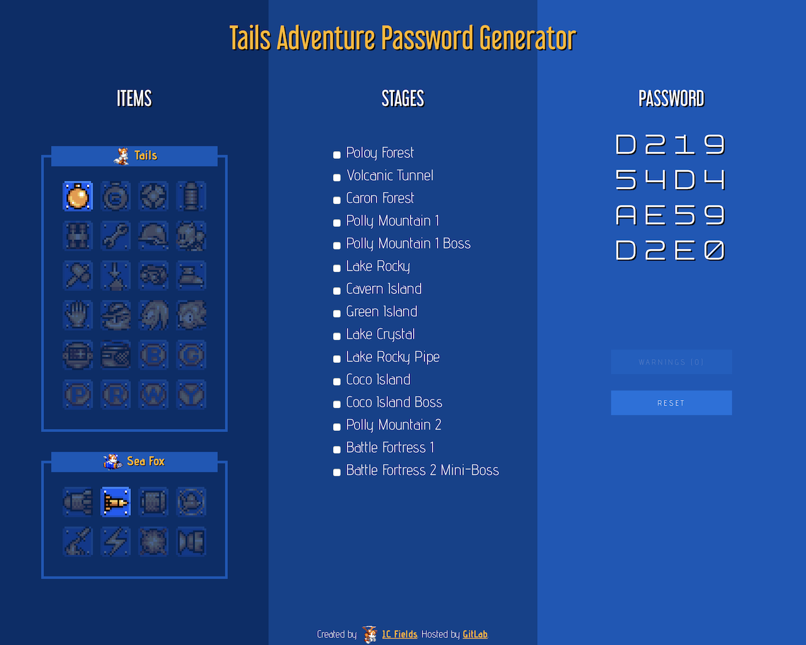
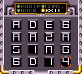

# tailsadv-password-generator

A [password generator for *Tails Adventure*](https://jcfieldsdev.github.io/tailsadv-password-generator/). Written in JavaScript. *Tails Adventure* is a platform game with RPG elements that was released for the Sega Game Gear in 1995.

## Acknowledgments

Based on an earlier [password generator](http://xfox_prower.tripod.com/games/tagen.htm) by [XFox Prower](http://xfox_prower.tripod.com/).

Uses [Vector Tails icon](https://www.deviantart.com/nibroc-rock/art/Vector-Icon-Tails-524574874) by [Nibroc-Rock](https://www.deviantart.com/nibroc-rock).

Uses Advent Pro font by Andreas Kalpakidis, [Libel Suit](https://typodermicfonts.com/libel-suit/) font by [Typodermic Fonts](https://typodermicfonts.com/), and [Software Tester 7](http://www.styleseven.com/php/get_product.php?product=Software%20Tester%207) font by [Style Seven](http://www.styleseven.com/).

## Authors

- J.C. Fields <jcfields@jcfields.dev>

## License

- [MIT license](https://opensource.org/licenses/mit-license.php)

## See also

- [*Sonic CD* Save Editor](https://github.com/jcfieldsdev/sonic-cd-save-editor)—A save editor for the Sega CD game *Sonic CD*.
- [*Sonic 3* Save Editor](https://github.com/jcfieldsdev/sonic3-save-editor)—A save editor for the Genesis game *Sonic 3*.
- [*Knuckles Chaotix* Save Editor](https://github.com/jcfieldsdev/chaotix-save-editor)—A save editor for the 32X game *Knuckles Chaotix*.
- [*Sonic Mania* Save Editor](https://github.com/jcfieldsdev/sonic-mania-save-editor)—A save editor for *Sonic Mania*.

